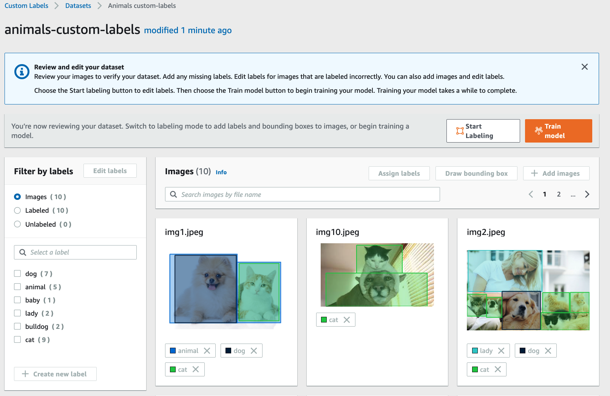

# Amazon Rekognition Custom Labels - Managing a datset Example 

### 사전 준비 작업
+ my-rekognition-customlabels-XYZ 이라는 S3 버킷을 생성한다. (S3 bucket 이름이 중복되지 않도록 `XYZ` 를 적절하게 다른 문자열로 변경해야한다)
+ my-rekognition-customlabels-XYZ 아래에 animals 라는 디렉터리를 생성한다.
+ animals 라는 directory 안에 dataset/animals 디렉터리에 있는 10장의 샘플 이미지를 저장한다.

### SageMaker Ground Truth format manifest 파일을 이용해서 dataset 생성하기

1. manifest 파일 작성 한다.<br/>
참고로, 예제로 주어진 data의 input.manifest 
[Amazon Rekognition Custom Labels - Object localization(Bounding Box) in manifest files](https://docs.aws.amazon.com/rekognition/latest/customlabels-dg/cd-manifest-files-object-detection.html) 을 참고해서 작성했다.
예제로 주어진 input.manifest 파일을 텍스트 편집기(예: vim, VisualCode 등)로 열어서, my-rekognition-customlabels-XYZ 부분을 샘플 이미지가 업로드된 S3 버킷으로 변경한다.<br/>
    예)

    XYZ를 12345로 변경했을 경우,

    **변경 전**
    ```
    {"source-ref":"s3://my-rekognition-customlabels-XYZ/animals/img4.jpeg", ...}
    ```

    **변경 후** 

    ```
    {"source-ref":"s3://my-rekognition-customlabels-12345/animals/img4.jpeg", ...}
    ```

2. manifest 파일을 s3 버킷에 업로드한다
3.  Amazon Rekognition 웹 콘솔 [https://console.aws.amazon.com/rekognition/](https://console.aws.amazon.com/rekognition/)에 접속한다.
4.  **Use Custom Labels** 를 선택한다.
5.  **Get started** 를 선택한다.
6. 왼쪽 상단의 메뉴에서 **Datasets** 을 선택한다.
7. **Datasets** 에서 **Create dataset** 을 선택 한다.<br/>

8. **Create dataset** 상세 페이지에서 dataset 이름을 입력한다. (animals-custom-labels)
9. **Image location** 에서 **Import images labeled by SageMaker Ground Truth** 를 선택한다.
10. **.manifest file location** 에 2단계에서 업로드한 `input.manifest` 파일의 S3 위치를 넣는다.
`input.manifest` 파일의 S3 위치를 **.manifest file location** 에 기록하면, 
Amazon Rekognition Custom Labels 서비스가 S3 버킷에 접근하기 위해 필요한 S3 Bucket Policy가 출력되는데, 
이 가이드 대로 S3 버킷의 Permission이 설정되어 있는지 확인이 필요하다.<br/>

11. **Submit** 를 선택하면,  다음과 같은 화면을 볼 수 있다.<br/>


### Dataset 삭제 방법
- <span style="color:red">Dataset을 삭제하기 위해서는 주의하실 점은 s3에 upload된 이미지 데이터를 삭제한다고 Dataset에서 삭제되는 것이 아니라, manifest 파일에서 삭제할 이미지 데이터에 대한 정보를 삭제해야 한다.</span>

1. AWS 웹 콘솔의 [Amazon Rekognition Custom Labels 서비스](https://console.aws.amazon.com/rekognition/)에 접속한다.
2. 왼쪽 위의 메뉴에서 **Datasets** 을 선택한다.
3. **Datasets** 에서 삭제할 데이터의 **Location**, 즉 S3 위치를 클릭해서, `*.manifest` 파일의 S3 위치를 확인한다.
4. `*.manifest` 파일을 S3에서 다운로드 한 후, 삭제할 dataset을 `*.manifest` 파일에서 삭제한다.<br/>
    예)
    (1) 최초 **.manifest** 파일 내용
    ```json
    {"source-ref":"s3://my-rekognition-customlabels-XYZ/aws/aws-1.png","test-dataset_BB":{"annotations":[{"left":13,"top":189,"width":975,"height":613,"class_id":0}],"image_size":[{"width":1000,"height":1000,"depth":3}]},"test-dataset_BB-metadata":{"job-name":"labeling-job/test-dataset_BB","class-map":{"0":"aws"},"human-annotated":"yes","objects":[{"confidence":1}],"creation-date":"2021-05-13T12:48:15.600Z","type":"groundtruth/object-detection"}}
    {"source-ref":"s3://rekognition-customlabels-use1/aws/aws-10.png","test-dataset_BB":{"annotations":[{"left":19,"top":11,"width":510,"height":316,"class_id":0}],"image_size":[{"width":1480,"height":340,"depth":3}]},"test-dataset_BB-metadata":{"job-name":"labeling-job/test-dataset_BB","class-map":{"0":"aws"},"human-annotated":"yes","objects":[{"confidence":1}],"creation-date":"2021-05-13T12:48:39.138Z","type":"groundtruth/object-detection"}}
    ```
    (2) "aws-1.png" 파일을 삭제 한 후, output.manifest 파일 내용
    ```json
    {"source-ref":"s3://my-rekognition-customlabels-XYZ/aws/aws-10.png","test-dataset_BB":{"annotations":[{"left":19,"top":11,"width":510,"height":316,"class_id":0}],"image_size":[{"width":1480,"height":340,"depth":3}]},"test-dataset_BB-metadata":{"job-name":"labeling-job/test-dataset_BB","class-map":{"0":"aws"},"human-annotated":"yes","objects":[{"confidence":1}],"creation-date":"2021-05-13T12:48:39.138Z","type":"groundtruth/object-detection"}}
    ```
5. 수정한 `*.manifest` 파일을 `*.manifest` 파일이 처음 위치한 s3에 다시 upload 한다.<br/>
`*.manifest` 파일 upload 후, Amazon Rekognition Custom Labels의 Datasets 화면을 refresh 하면, Images 수가 변경된 것을 확인 할 수 있다.

### References
+ [Amazon Rekognition Custom Labels - Creating a manifest file](https://docs.aws.amazon.com/rekognition/latest/customlabels-dg/cd-manifest-files.html)
+ [Amazon Rekognition Custom Labels - Object localization(Bounding Box) in manifest files](https://docs.aws.amazon.com/rekognition/latest/customlabels-dg/cd-manifest-files-object-detection.html)
+ [Amazon Rekognition Custom Labels - Image-Level labels in manifest files](https://docs.aws.amazon.com/rekognition/latest/customlabels-dg/cd-manifest-files-classification.html)